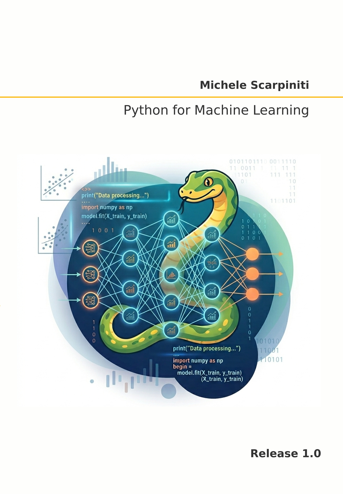

# Python for Machine Learning

This repository contains all the sorce code of [**Python for Machine Learning**](https://www.amazon.it/dp/B0HKNG117D) book, in the form of Jupyter notebooks.
The book, based on the author's teaching experience, aims to introduce the fundamental concepts of Python with applications in machine learning and its applications.




## Index
1. [Introduction](Notebooks/1_Introduction.ipynb)
2. [Python environment](Notebooks/2_Python_environment.ipynb)
3. [Python basics](Notebooks/3_Python_basics.ipynb)
4. [Python coding](Notebooks/4_Python_coding.ipynb)
5. [Main Python libraries](Notebooks/5_Main_Python_libraries.ipynb)
6. [Data manipulation](Notebooks/6_Data_manipulation.ipynb)
7. [Exploratory Data Analysis](Notebooks/7_Exploratory_Data_Analysis.ipynb)
8. [Introduction to machine learning](Notebooks/8_Introduction_to_machine_learning.ipynb)
9. [Optimization for machine learning](Notebooks/9_Optimization_for_machine_learning.ipynb)
10. [Adaptive filtering](Notebooks/10_Adaptive_filtering.ipynb)
11. [Machine learning from scratch](Notebooks/11_Machine_learning_from_scratch.ipynb)
12. [The Scikit-learn library](Notebooks/12_The_Scikit-learn_library.ipynb)
13. [Data preparation](Notebooks/13_Data_preparation.ipynb)
14. [Model evaluation](Notebooks/14_Model_evaluation.ipynb)
15. [Ensemble learning](Notebooks/15_Ensemble_learning.ipynb)
16. [Underfitting and overfitting](Notebooks/16_Underfitting_and_overfitting.ipynb)
17. [Probability density estimation](Notebooks/17_Probability_density_estimation.ipynb)
18. [Clustering](Notebooks/18_Clustering.ipynb)
19. [Complete machine learning projects](Notebooks/19_Complete_machine_learning_projects.ipynb)
20. [Reinforcement learning](Notebooks/20_Reinforcement_learning.ipynb)
21. [Concluding remarks](Notebooks/21_Concluding_remarks.ipynb)
<ol type="A">
<li><a href="Data representation and sampling">Notebooks/A_Data_representation_and_sampling.ipynb]</a></li>
<li>[Probability and stochastic processes]()</li>
<li>[Estimation theory]()</li>
<li>[Metaheuristic optimization]()</li>
<li>[Reproducible machine learning]()</li>
<li>[Ethics and responsible machine learning]()</li>
</ol>


## About
The book, based on the author's teaching experience, aims to introduce basic Python programming and the fundamental concepts of machine learning through a practical and progressive approach. It is designed as an active learning resource. Readers are encouraged to reproduce the examples and investigate the effects of different hyperparameters.


## Python requirements
The book was written and tested with Python 3.12, though other Python 3.x versions should work in nearly all cases.


If you have Git installed, you can clone the book repository, otherwise simply download it and move to the correct folder:
```
git clone https://github.com/mscarpiniti/PyMLBook.git
cd PyMLBook
```


To use the code, it is suggested to create a new Python 3.12 environment (i.e., `PyML`) with Spyder and `pip`:
```
conda create -n PyML python=3.12 Spyder pip
```

Then activate the environment and install all requirements:
```
conda activate PyML
pip install -r requirements.txt
```

#### Want to play with these notebooks online without having to install anything?

Open this repository in [Colaboratory](https://colab.research.google.com/github/mscarpiniti/PyMLBook/blob/master/):
<a href="https://colab.research.google.com/github/mscarpiniti/PyMLBook/blob/master/"></a>


## License
The code in this repository, including all code samples in the notebooks listed above, is released under the [Apache License, Version 2.0](LICENSE). Read more at the [Open Source Initiative](https://opensource.org/license/apache-2.0).
